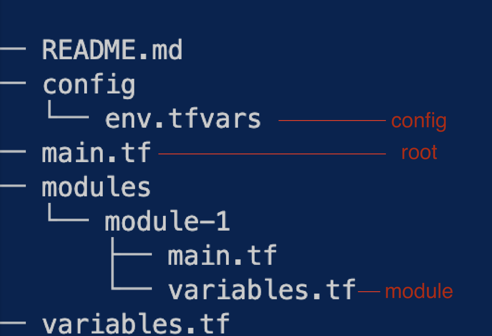

## Parameters
1. [Defaults](#defaults)
2. [Looping](#looping)
3. [Merging](#merging)
4. [Modules](#modules)
  

### Defaults
In a simple project three locations matter:

  

Default values can help reduce the number of parameters that need to be passed to a module.
First define as many as reasonable defaults inside the `variables.tf` inside the module. 
This allows you to avoid the variable completely in the module call, but if needed you can still add it when you want to override the default.

We can do the same with variables in root. Simply add a default, and you can avoid passing it in the `config/env.tfvars`, but this way you can keep a default value out of the module if that is not desired.

Your `config/env.tfvars` should contain the least number of variables as possible, and focus on the core values that change between environments.
  

### Looping
Learning how to address variables in Terraform is useful.
Loop as much as possible outside of modules, so that modules are as simpel and clear as possible.

See [here](./2.looping/main.tf) for examples.
  

### Merging
Merging is a good way to combine defaults with custom values, while also retaining the option of only using defaults.

See [here](./3.merge/good-example/main.tf) for an example.
  

### Modules
Use the `module.output.output-name` in a smart way.

See [here](./4.modules/main.tf) for an example.
