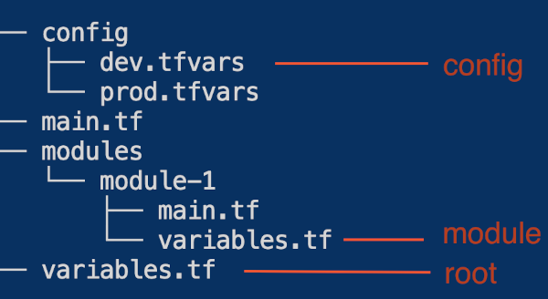

## Parameters
1. [Defaults](#defaults)
2. [Looping](#looping)
3. [Merging](#merging)
4. [Modules](#modules)
  

### Defaults
In a simple project three locations matter:

  

Default values can help reduce the number of parameters that need to be passed to a module.
First define as many as reasonable defaults inside the `variables.tf` inside the module. 
This allows you to avoid the variable completely in the module call, but if needed you can still add it when you want to override the default.

We can do the same with variables in root. Simply add a default, and you can avoid passing it in the `config/env.tfvars`, but this way you can keep a default value out of the module if that is not desired.

Your `config/env.tfvars` should contain the least number of variables as possible, and focus on the core values that change between environments.

#### Execute instructions
`tf init` # inside the bad or good folder
`tf plan -var-file=config/env.tfvars`
or
`tf plan -var-file=config/prod.tfvars`

In order to re-trigger to test with different values, change parameter1, this is the trigger which recreates the null resource.

See [here](1.defaults/) for an example.
  

#### Intermezzo: Template function
When using some commands as shown here in the null resources in "./1.defaults" the best way yo go is to use the [template function](https://developer.hashicorp.com/terraform/language/functions/templatefile)
  

### Looping
Learning how to address variables in Terraform is useful.
Loop as much as possible outside of modules, so that modules are as simple and clear as possible.

See [here](./2.looping/count-loop.tf) for an example.
  

### Merging
Merging is a good way to combine defaults with custom values, while also retaining the option of only using defaults.

See [here](./3.merge/main.tf) for an example.

(see lines 18-23 for the merge function)
  

### Modules
Modules are essential to developing clean terraform code, but some patterns are needed to make them work well.

Use the `module.output.output-name` in order to communicate variables between modules.

Use a conditional statement to make modules more flexible and deploy resources only when needed.

See [here](./4.modules/conditional-components.tf) for an example.

